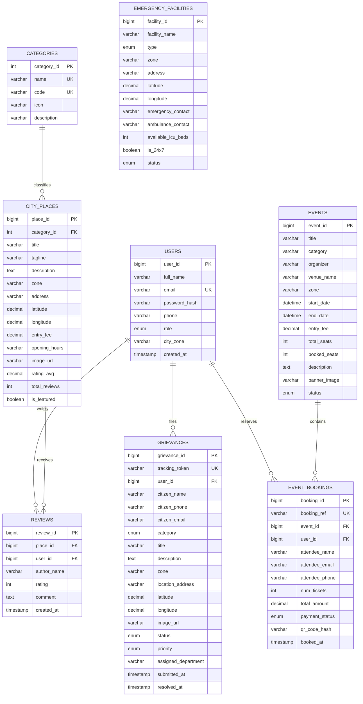

# Smart City Database Architecture & ER Diagram Specification

## 1. Entity-Relationship (ER) Overview
The `smart_city_db` database is designed according to **3rd Normal Form (3NF)** standards with relational integrity, foreign key cascades/set-null constraints, and indexing for high performance.

---

## 2. Table Specifications & Relationships

| Table Name | Primary Key | Foreign Key References | Purpose |
| :--- | :--- | :--- | :--- |
| `users` | `user_id` | - | Manages Citizens, Tourists, Municipal Officers, and Admins. |
| `categories` | `category_id` | - | Defines taxonomy for attractions (Heritage, Parks, Museums, Food, Transit). |
| `city_places` | `place_id` | `category_id` &rarr; `categories(category_id)` | Stores smart city attractions, coordinates, opening hours, pricing. |
| `emergency_facilities` | `facility_id` | - | Emergency health, police, fire, blood bank stations with real-time bed counts. |
| `grievances` | `grievance_id` | `user_id` &rarr; `users(user_id)` | Citizen complaints with unique tracking token, GPS geotag, and status lifecycle. |
| `events` | `event_id` | - | City exhibitions, marathons, cultural summits with seat allocations. |
| `event_bookings` | `booking_id` | `event_id` &rarr; `events`, `user_id` &rarr; `users` | Issued digital E-Passes with cryptographic QR hash. |
| `reviews` | `review_id` | `place_id` &rarr; `city_places`, `user_id` &rarr; `users` | Crowdsourced ratings & feedback for city landmarks. |
